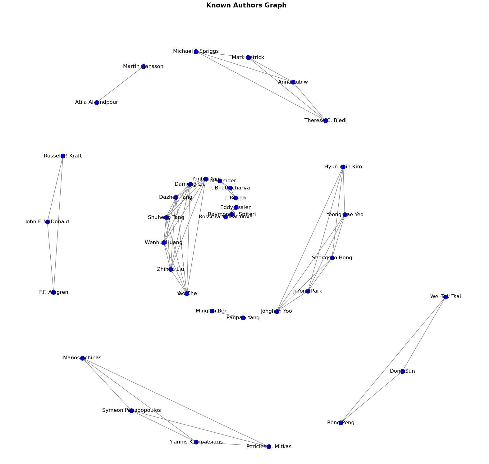
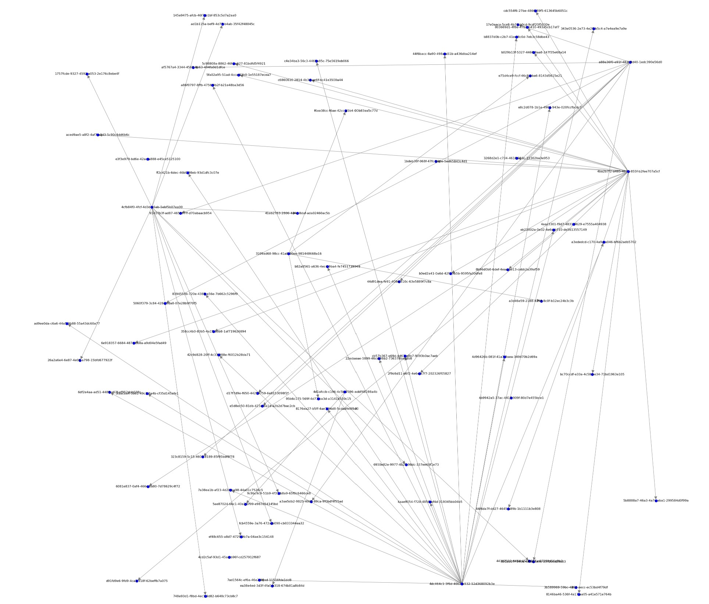
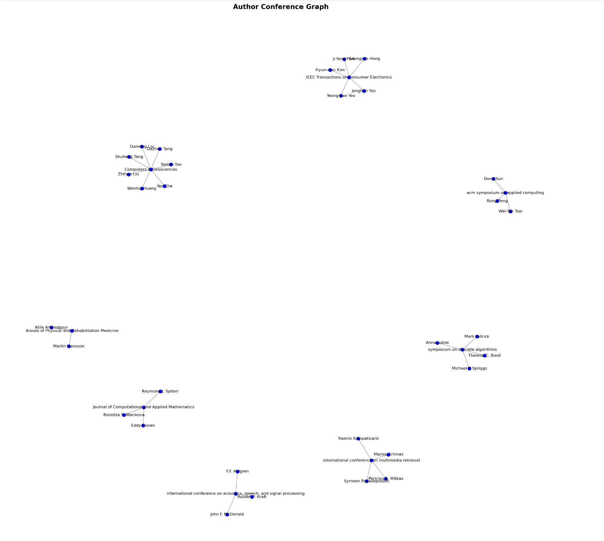

# DBLP Data Set Graph Analysis

## Project Overview
This project focuses on analyzing the DBLP database, which contains information on authors, publications, conferences, and citations within the computer science domain. The primary objective is to apply graph theory methodologies to extract meaningful insights related to academic collaborations, citation networks, and research impact.

## Data & Preprocessing
- Extracted and refined data from DBLP JSON files.
- Validated approach using a small sample before running full-scale analysis.
- Constructed three types of graphs for analysis:
  - **Known-Authors Graph** – Undirected graph connecting co-authors.
  - **Paper Citation Graph** – Directed graph mapping citations among papers.
  - **Author-Conference Graph** – Undirected graph linking authors to the conferences they published in.

## Analysis Questions
**Analysis 0**
Run the network characteristics package given to you on all the graphs you
will be using for analysis and understand various characteristics. Especially, how they differ for each graph and their implications on the analysis you will be doing.

**Analysis 1**
You need to do all of your chosen analysis (0, 1, 2, and 3a or 3b) on the
sample data and include them in the report along with your manually verified values
(known as the ground truth).

**Analysis 2**
Find maximal groups of authors who are all mutually connected. Initially,
you may want to use 3 or 4 and then go to maximal if the package allows you to do that. Otherwise, do it for 3, 4, and 5. This is for your entire data set.

**Analysis 3**
- Find 5 to 10 papers that are cited most from these two years from the
paper citation graph
- Find 5 to 10 authors who have published most papers in your data set
irrespective of the conferences.

## Results & Insights

### Known-Authors Graph for sample data

### Paper Citation Graph for sample data

### Author-Conference Graph for sample data

### **Known-Authors Graph**
- **Total Unique Authors:** 77,723  
- **Total Edges (Connections):** 147,612  
- **Graph Density:** 4.887177775127137e-05  
- **Connected Components:** 14,154  
- **Maximum Degree:** 105 (Most connected author: Wei Wang)  
- **Average Degree:** 3.79  

### **Paper Citation Graph**
- **Total Papers (Nodes):** 227,879  
- **Total Citations (Edges):** 291,639  
- **Maximum Degree (Most Cited Paper):** 219 (Paper ID: `ac20391b-bbff-4926-9c74-08dd0fdac740`)  
- **Graph Density:** 5.616152554834257e-06  

### **Author-Conference Graph**
- **Total Authors & Conferences (Nodes):** 70,305  
- **Total Edges:** 80,199  
- **Maximum Degree (Most Published Author):** 2,574  
- **Graph Density:** 3.24513449542644e-05  

### **Key Findings**
- The most connected author (Wei Wang) has co-authored with 105 different researchers.
- The most cited paper in the dataset has 219 citations.
- The most published authors have contributed to over 2,574 papers in the dataset.
- The maximal author collaboration clique size is **31**, meaning there are groups of 31 authors who are all directly connected.
- The paper with the highest out-degree has cited **23 other papers**.

## Skills & Tools Used
- **Programming & Data Handling:** Python, Pandas, JSON  
- **Graph Analysis:** NetworkX, Graph Theory, Centrality Measures  
- **Data Visualization:** Matplotlib  
- **Algorithms:** Depth-First Search (DFS) Degree Distribution  
- **Big Data Processing:** Handling large datasets efficiently  

## License
This project is licensed under the MIT License. See the [LICENSE](LICENSE) file for details.

## Data Source
The DBLP dataset used in this project is provided by the dblp computer science bibliography. For more information, visit their [official website](https://dblp.org/).
By leveraging graph theory and network analysis, we identified key research trends, influential authors, and impactful papers within the DBLP dataset. These insights can be used for further academic research, recommendation systems, and collaboration network studies.

---

